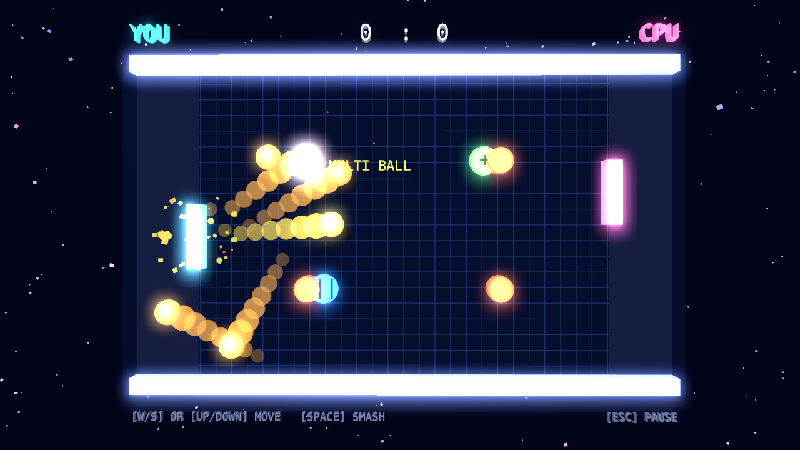
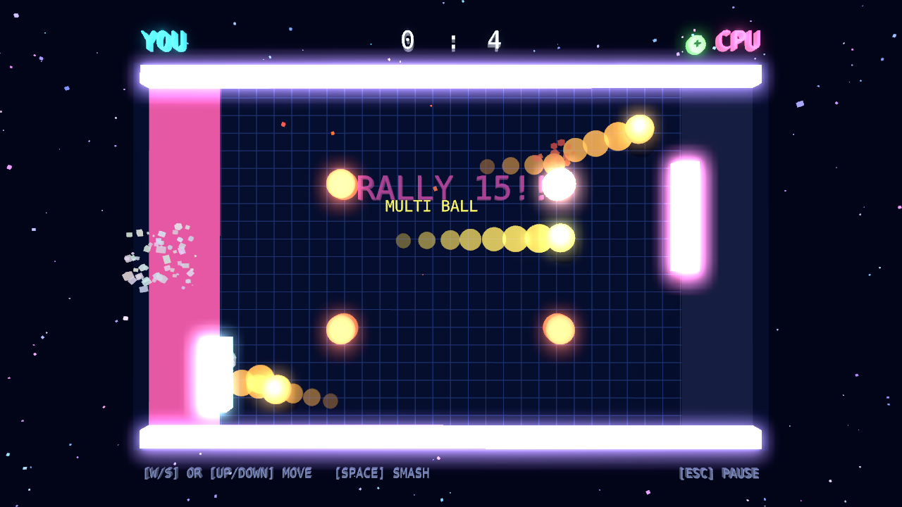
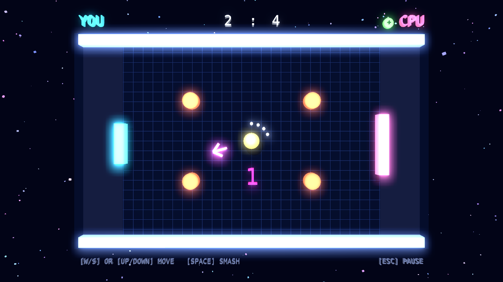
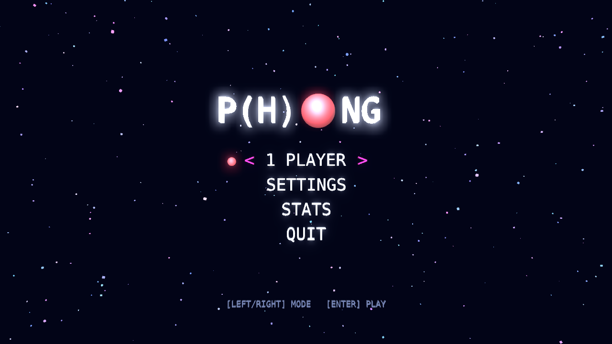
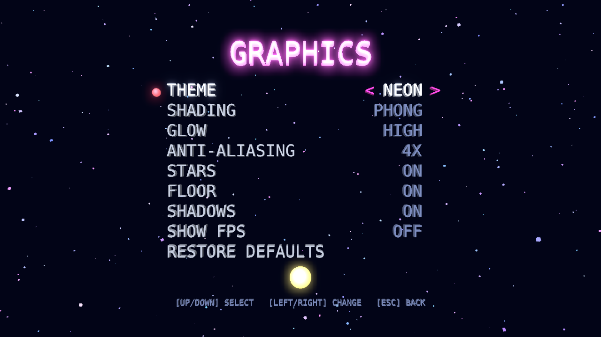
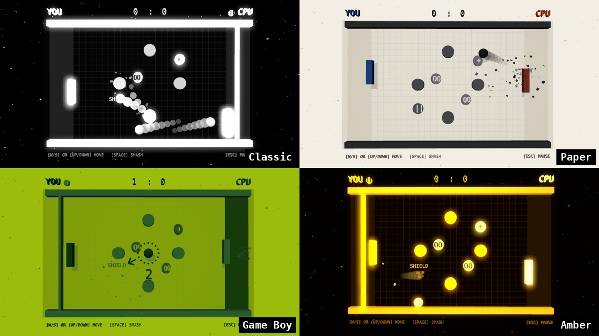

# P(H)ONG

Pong in a 3D rendered world on a 2D playing field, built with Qt Quick 3D and
Qt Quick 3D Physics. The rules, the computer opponent and the settings are
C++, the scenes are QML.



| | |
|---|---|
|  |  |
|  |  |

## Play

The browser version is at <https://iam-peter.github.io/phong/>, ready-made
downloads for Linux (AppImage), Windows and macOS are on the
[nightly release](https://github.com/iam-peter/phong/releases/tag/nightly).
Both are built every night from the latest commit, nights without a new
commit are skipped. The macOS app isn't signed, it opens with a right click
and Open the first time.

The [workflow](.github/workflows/nightly.yml) also runs the tests on all
three systems. It can be started by hand under Actions, Nightly, Run
workflow. The pages need Settings, Pages, Source set to GitHub Actions once.

## Requirements

- Qt 6.9 or newer (`ExtrudedTextGeometry`) with the Qt Quick 3D,
  Qt Quick 3D Physics and Qt WebSockets modules
- Qt Multimedia for sound on the desktop, optional
- SDL 3 for gamepads on the desktop, the build downloads it if it isn't
  installed, the browser has gamepads anyway
- CMake 3.21 or newer
- For WebAssembly: the Qt `wasm_singlethread` kit and the Emscripten version
  it was built with (Qt 6.11: 4.0.7, Qt 6.12: 5.0.5)

## Checkout

```
git clone https://github.com/iam-peter/phong.git
```

## Build

### Desktop

```
~/Qt/6.11.1/gcc_64/bin/qt-cmake -S . -B build/desktop -G Ninja
cmake --build build/desktop
ctest --test-dir build/desktop
./build/desktop/phong
```

### SDL 3 for gamepads

The desktop build uses an installed SDL 3 for gamepads. Without one it
downloads SDL 3.2.30 while configuring and builds the gamepad parts into
the game, so nothing needs installing. `-DPHONG_FETCH_SDL3=OFF` builds
without gamepads instead of downloading.

Few distributions package SDL 3 yet. Ubuntu has it since 25.04:

```
sudo apt install libsdl3-dev
```

On Ubuntu 24.04 and other systems without a package, SDL 3 builds from its
source release and installs to `/usr/local`, where CMake finds it on its
own. The build dependencies first, `libudev-dev` lets SDL find gamepads
plugged in while the game runs, the full list is in SDL's
[docs/README-linux.md](https://github.com/libsdl-org/SDL/blob/main/docs/README-linux.md):

```
sudo apt install build-essential cmake ninja-build libudev-dev libdbus-1-dev \
    libx11-dev libxext-dev libwayland-dev libxkbcommon-dev libpulse-dev libasound2-dev
```

Then SDL itself:

```
curl -LO https://github.com/libsdl-org/SDL/releases/download/release-3.2.30/SDL3-3.2.30.tar.gz
tar xzf SDL3-3.2.30.tar.gz
cmake -S SDL3-3.2.30 -B SDL3-build -G Ninja -DCMAKE_BUILD_TYPE=Release
cmake --build SDL3-build
sudo cmake --install SDL3-build
```

An SDL 3 installed somewhere else is found with
`-DSDL3_DIR=<prefix>/lib/cmake/SDL3`. The configure output says which one
the build uses: `Gamepads with SDL3 3.2.30`, after `Fetching SDL 3 for
gamepads` if it downloaded it. A build that fetched SDL before udev was
installed gets it after removing `build/desktop/_deps` and configuring
again.

### WebAssembly

```
source ~/emsdk/emsdk_env.sh
~/Qt/6.11.1/wasm_singlethread/bin/qt-cmake -S . -B build/wasm -G Ninja \
    -DCMAKE_BUILD_TYPE=Release -DQT_HOST_PATH=$HOME/Qt/6.11.1/gcc_64
cmake --build build/wasm
python3 -m http.server -d build/wasm
```

Then open <http://localhost:8000/phong.html>. Settings are kept in the
browser's local storage.

### Server

`phong-server` opens rooms for games over the internet and keeps the shared
high scores of endless and squash. The
[nightly release](https://github.com/iam-peter/phong/releases/tag/nightly)
has it ready to run: `Phong-server-linux-x64.tar.gz` with the Qt libraries
it needs, next to `phong.exe` in the Windows zip, and in
`phong.app/Contents/MacOS` on macOS. The desktop build builds it along,
`-DPHONG_BUILD_SERVER=OFF` leaves it out. It only needs Qt Core and Qt
WebSockets 6.2 or newer, so it also builds on its own with the Qt of a
distribution, e.g. on a server running Ubuntu 24.04:

```
sudo apt install cmake g++ qt6-base-dev qt6-websockets-dev
cmake -S server -B build/server -DCMAKE_BUILD_TYPE=Release
cmake --build build/server
./build/server/phong-server --port 45460 --scores scores.json
```

The server speaks plain WebSockets. The browser version on an HTTPS page can
only reach it over TLS, `wss://`, so a public server goes behind a proxy
that adds TLS, e.g. Caddy with `reverse_proxy localhost:45460`.

## Controls

| | Against the computer | 2 Players |
|---|---|---|
| Left paddle | `W`/`S` or `Up`/`Down` | `W`/`S` |
| Left smash | hold `Space`, `D` or `Left` | hold `D` |
| Right paddle | computer | `Up`/`Down` |
| Right smash | computer | hold `Left` |
| Dash | tap a direction twice | tap a direction twice |
| Special | `A` or `Right` | `A`, `Right` |
| Mouse / touch | drag anywhere | drag on your half |

`Esc` or `P` pauses and resumes, the pause menu also leads back to the main
menu. Menus take arrow keys, `Enter` and clicks.

The keys of both players and the pause key can be changed on the controls
screen in the settings: pick an action and press the new key. A key that
another action has swaps with it, `Esc` and `Enter` stay with the menus.

### On the polygon

The 3-6 Players mode has two key sets of its own, the controls screen shows
them on a page of their own. The directions push the paddle along its side
the way it runs on the screen, like a stick, so the sides at the left and
the right move with up and down.

| | Keys 1 | Keys 2 |
|---|---|---|
| Move | `W` `A` `S` `D` | arrow keys |
| Smash | hold `Space` | hold `.` |
| Special | `E` | `,` |
| Dash | tap a direction twice | tap a direction twice |

A single keyboard player has both sets, the mouse steers the bottom side too.

### Gamepads

The first gamepad plays the left paddle, with two players the second one
the right paddle, next to the keys:

| | |
|---|---|
| Stick or d-pad | move, as fast as the stick is tilted |
| `A` | smash, hold to wind up |
| `B` | special |
| `X`, shoulder buttons | dash the way the stick points |
| `Start` | pause |

In the menus the stick and the d-pad move, `A` confirms and `B` goes back.
The controls screen maps smash, special, dash and pause to other buttons
too, for every pad at once: pick one and press the button. The d-pad and
`Back` stay fixed, the shoulder buttons dash as long as nothing else is
mapped to them.
Pads that can rumble do on hits, harder on smashes and specials, and most
on a goal against their player, also on the LAN. `Rumble` in the settings
switches it off.
The browser reads gamepads with the Gamepad API, the desktop with SDL 3,
see [SDL 3 for gamepads](#sdl-3-for-gamepads) for installing it.

Moving the paddle while it hits the ball puts spin on it: brushed upwards the
ball dips on its way over, brushed downwards it rises.

Holding the smash key winds up the paddle, it glows and slows down. The next
return is faster, a full wind up takes 0.6 seconds and even goes beyond the
top speed. The computer smashes too, on Normal now and then, on Hard often.

Tapping a direction twice dashes, the paddle shoots a few units that way.
After a dash it takes a second before the next one: the paddle goes dark
and lights up again from the bottom, when it glows all over it can dash
again. On Normal and Hard the computer dashes for
balls it wouldn't reach otherwise.

Every hit fills the power bar under the field by a segment, a perfect hit by
two. A full bar pulses and allows the special, like a super move in a
fighting game: the paddle catches the next ball and holds it to aim, see the
Magnet below. The computer uses its special as soon as it can.

A ball met with the middle of a paddle that stands still is a perfect hit,
it rings higher and flies faster, also beyond the top speed.

Rallies heat up: every hit climbs a musical scale, the walls and the grid glow
hotter, and every fifth hit gets a cheer. When a ball is about to decide the
match, the game slows down and moves in closer.

Callouts cheer the big moments: a shield stopping a goal is a save, a hard
smash returned with a hard smash a double smash, and levelling the score
after trailing by three a comeback. The rally that decided the match is
replayed before the results, its last second in slow motion, any key skips
it.

## Game modes

- **1 Player** against the computer, the level is set in the settings.
- **2 Players** on one keyboard, with gamepads, or with two fingers on a
  touch screen.
- **3-6 Players** on a regular polygon with a side for everybody, a
  triangle for three up to a hexagon for six. The middle of each side is its
  player's goal, posts at the ends keep the goals apart. Everybody has three
  balls to lose, a player who is out gets a wall instead of the goal, and
  the last one left wins. The paddles hit like on the classic field:
  smashes, perfect hits, spin, dashes and the power bar with its special.
  Two players can share the keyboard, see below, gamepads push their paddle
  along their side and the computer plays the others.
- **Ladder** against Easy, Normal and Hard in a row, a loss can be retried.
- **Endless** against a computer getting harder and faster the longer you
  last, with three balls to lose. Every return scores a point, every ball the
  computer misses ten, the best score is kept.
- **Tournament**, a knockout bracket of eight against computer players with
  their own ways: the Rookie, the Pro and the Ace play like Easy, Normal and
  Hard, the Wall returns everything straight and never smashes, the Spinner
  brushes every ball to curve it, the Smasher winds up almost every return
  and the Collector sends the ball through the modifiers. The other matches
  of a round are decided by the strength of the two.
- **Bricks** against the computer, with a wall of bricks in the middle and a
  gap for the kickoff. A brick breaks when hit and gives the player who sent
  the ball a point, every third one drops a modifier instead. Once the wall
  is down a new one is built for the next kickoff.
- **Squash** alone against a closed wall with three balls to lose, the
  longest rally is the score.

The menu cycles through the modes with `Left`/`Right`, `Enter` plays.

Both start in a lobby that shows who plays which side. A gamepad joins with
`A`, leaves with `B` and starts with `Start`. With two players the first
pad takes the right side, the second one the left, the keyboard plays the
rest. In the polygon mode `Keyboards` gives the keyboard to one or two
players, the second one takes the next side.

### On the LAN

In the lobby of 2 Players and of the polygon mode `LAN open` lets players on
the local network join. The host runs the game, the others send their
paddle, smashes, specials and dashes and get the picture back, on the
polygon each with their own side at the bottom. `Join game` in
the menu lists the games open on the network. The browser build can't look
for games or open one, but it joins a desktop host by the address the host
shows in its lobby, e.g. `192.168.1.5:45455`. The game uses TCP port 45455
for the players and UDP port 45454 to find games, a firewall has to let
them through. A player who leaves is replaced by the computer, only the host
pauses, the others can leave with `Esc`.

A player who left and joins again gets their side back from the computer,
the game recognises the machine. Everybody else who joins a game that is
already running, or a lobby without a free side, watches: the game shows
up without a side to play, `Esc` leaves. The list of games says which ones
are playing or full.

### Over the internet

`Online open` in the lobby opens a room on a [server](#server) and shows
its four letter code. The others join with `Join game`, `Room code` and the
code, from anywhere, the browser version too, which can also host this way.
The server is set under Settings, Online, next to the name the others see.
Without a name they see "Player", the machine's name only goes out on the
LAN.

Over longer distances the messages take a while. A joined machine measures
the time to the host and back and shows it at the bottom. Its own paddle
answers the keys right away instead of waiting for the host, and the ball
flies on for half that time, until the next state comes in.
`phong-server --lag 100` holds every message back for 100 ms, to try the
game with a slow connection.

On Normal and Hard the computer aims its returns through modifiers it wants,
Hard also plays the ball away from your paddle.

Every point starts with a kickoff countdown, one to three seconds, and an
arrow showing where the ball will go. Like in football the player who was
scored against kicks off, the ball flies towards the scorer.

With a [server](#server) set under Settings, Online, endless and squash
also have a list everybody shares: the results show the five best of
everybody next to your own. A score goes on it with the name set there,
without a name the game only shows the list.

A match is a single set or best of three or five, optionally won by two
points. The stats screen keeps the record against every computer level, the
best ladder run, the endless and squash high scores, the tournaments won,
the games of three to six players and the longest rally.

### Achievements

Fourteen challenges wait on the achievements screen, next to the stats, from
the first win against the computer to a rally of 20 on Elevators, a goal
with a smash, five perfect hits in a match, a win after trailing by three
or 100 points in endless play, and winning on the polygon, once against
five others. They count for the player against the computer or the wall
and for the winner of a polygon game on its machine, the results show the
ones a match brought. Resetting the stats resets them too.

## Modifiers

Now and then a modifier appears on the field. The ball collects it by flying
through, and the player who touched the ball last gets the effect. Right
after a serve the ball flies through without collecting anything.

| | Modifier | Effect |
|---|---|---|
| `>>` | Fast ball | the ball speeds up towards the opponent |
| `+` | Big paddle | the collector's paddle grows for 12 s |
| `\|\|` | Shield | a barrier behind the collector's paddle stops one goal, it stays until hit |
| `-` | Small paddle | curse, the opponent's paddle shrinks for 12 s |
| `@` | Spin curse | curse, the opponent's paddle rotates for 7 s and the ball bounces off its surface |
| `=` | Narrow field | the walls move in for 12 s |
| `oo` | Multi ball | two extra balls fly at the opponent for 12 s, their goals count |
| `U` | Magnet | the collector's paddle catches the next three balls within 12 s |
| `()` | Portals | two linked portals open for 10 s, a ball flying into one comes out of the other |
| `*` | Freeze | curse, the opponent's paddle freezes for 1.5 s |
| `?` | Reversed | curse, the opponent's controls are swapped for 7 s |
| `~` | Ghost ball | the balls can't be seen in the middle third of the field for 8 s |
| `O` | Gravity well | a well bends the flight of the balls for 10 s |

A magnetic paddle holds a caught ball for up to 1.2 seconds. Meanwhile the
paddle stands and the movement keys slide the ball along it, the ball leaves
at the angle of where it sits. Letting go of the smash key throws it, wound
up as long as the key was held.

Active effects show next to the player names. Modifiers can be switched off
in the settings. Curses get to the computer as well: reversed it reacts
slower and less accurately, and it can't follow a ghost ball either.

On the polygon of 3-6 Players the modifiers appear around the middle. The
ones made for two sides stay away there: spin curse, narrow field, multi
ball and portals. A curse hits every other player still in, the shield
stands in front of the collector's goal and the ghost ball vanishes in a
circle around the middle.

### Configuration

The modifiers are defined in [config/modifiers.json](config/modifiers.json),
which is compiled into the game. On the desktop another file can be tried
without rebuilding:

```
./build/desktop/phong --modifiers my-modifiers.json
```

The effects are built in, the file decides which modifiers exist and how they
use them:

| Key | Meaning |
|---|---|
| `spawn.minDelay`, `spawn.maxDelay` | seconds between two spawns |
| `spawn.maxItems` | items on the field at the same time |
| `spawn.lifetime` | seconds until an item that nobody collected disappears |
| `spawn.minDistance` | minimum distance between two items |
| `id`, `name`, `glyph`, `color` | identity and look |
| `effect` | `ballSpeed`, `paddleSize`, `shield`, `spin`, `narrowField`, `multiBall`, `magnet`, `portals`, `freeze`, `reverse`, `ghostBall` or `gravityWell` |
| `target` | `collector` (default), `opponent` for curses, or `both` |
| `value` | speed or length factor, spin in degrees per second, inset of the walls, number of extra balls, catches, strength of the well |
| `duration` | seconds the effect lasts, all but `ballSpeed` and `shield` |
| `weight` | relative spawn chance, `0` never spawns |
| `enabled` | `false` skips the entry |

Values are clamped to a playable range, invalid entries are skipped with a
warning. A slow ball, for example, is the ball speed effect below 1:

```json
{ "id": "slowBall", "name": "Slow ball", "glyph": "<<", "color": "#ffff66",
  "effect": "ballSpeed", "value": 0.6 }
```

## Arenas

Every match picks an arena with round bumpers or blocks in the middle of the
field, or plays the one chosen in the settings. They are defined in
[config/arenas.json](config/arenas.json) and can be tried without rebuilding
with `--arenas my-arenas.json`:

```json
{ "id": "bumpers", "name": "Bumpers",
  "bumpers": [ { "x": 0, "y": 5, "radius": 1.3 } ],
  "blocks": [ { "x": 0, "y": -7, "width": 1, "height": 5 } ] }
```

Bumpers and blocks may move, `move` swings them back and forth around their
position, `period` is the time of a swing in seconds and `phase` where it
starts, from 0 to 1:

```json
{ "x": -5, "y": 0, "radius": 1.1, "move": { "y": 5, "period": 4, "phase": 0.5 } }
```

Obstacles outside the field or on the serve spot in the middle, also while
moving, are skipped with a warning.

## Graphics

P(H)ONG is Pong with Phong shading: every surface is lit by a key light from
above in front and shows a specular highlight, the ball is a shiny sphere. On
top of that bright surfaces glow like neon, the field has a floor with a grid
and soft shadows, and stars drift behind all screens.

Five themes set the colors: Neon, Classic in black, grey and white, Paper,
the four greens of the Game Boy and an amber monitor. The classic ones map
the colors of the modifiers onto their few shades.



The camera comes as close as every screen fits the window. On wide windows
the names, scores, power bars and keys sit beside the field and leave the
whole height to it, narrower ones have them above and below.

The graphics screen in the settings picks the theme and switches the rest on
and off: shading
(Phong or flat, unlit colors), glow (low, medium, high), anti-aliasing (fast is FXAA, 2x and 4x
multisampling), stars, floor, shadows and a frame rate display. The browser
and phones start with low glow and fast anti-aliasing, the desktop with high
glow and 4x multisampling.

## Sound

The sound effects are synthesized from a few tones, there are no audio files.
The desktop plays them with Qt Multimedia, the browser with the Web Audio API,
which starts after the first key press or click.

The music is made of the same tones, a chiptune loop over four chords that
the game sequences as it plays. It starts with a bass line at the kickoff,
and as the rally grows hi-hats, drums, an arpeggio and a lead come in and
the tempo rises. In slow motion it slows down too. The desktop sequences it
on the audio thread, the browser schedules it ahead on the audio clock, so
the beat keeps its time when the game is busy.

Sound and music can be switched off separately in the settings, the music
also has a volume of its own. `QT_LOGGING_RULES="phong.sound.debug=true"` logs what the audio
output does.

## Physics

Qt 3D, which the first version was built on, is not available for
WebAssembly, Qt Quick 3D is. That also made Box2D unnecessary: Qt Quick 3D
Physics (PhysX) does the collision detection, continuous collision detection
and goal triggers. The bodies are locked to the z = 0 plane, which turns the
3D engine into a 2D one.

The engine moves the ball, `Match` decides where it bounces to. Pong wants
arcade physics, a constant speed that grows with every hit and an angle that
depends on where the ball hits the paddle, so every contact report is
answered with the velocity the rules ask for.
